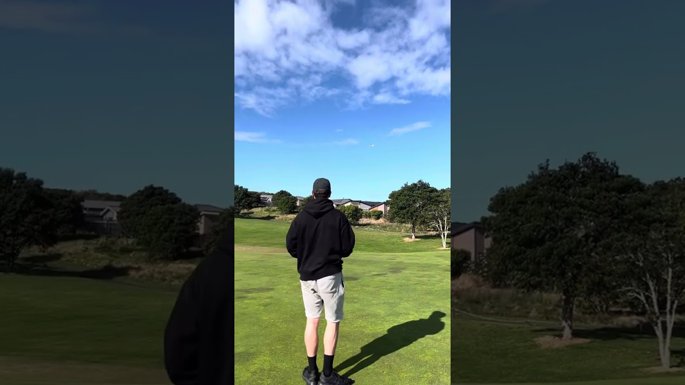

# VTOL_Project

After completing MECHENG 712 Aerohydrodynamics in my last year of University and competing in a glider competiion as part of an assignment I got hooked on flight and aerial vehicles. After some time learning about remote control (RC) aerial vehicles the concept of building a Vertical Take Off and Landing (VTOL) aircraft is something I would like to do. However, considering the complexity of such a project I have broken this down into managaeble stages. With zero background in RC aerial vehicles I will be starting from the very bottom. I have included flight controllers (FC) as a large aspect of this project as I am also interested in learning more about control system hardware and code. 

## Project Timeline
The following timeline roughly outlines the project stages. This will be updated as the project unfolds.

* Fixed Wing Build
* Fixed Wing FC Build
* Quadcopter Build
* Quadcopter FC Implementation
* Tricopter Build and FC Implementation
* VTOL Build and FC Implementation

## Fixed Wing Build
As an introduction to the world of RC aerial vehicles I have chosen to start with fixed wing aircraft. Starting off with a low cost platform to learn about aerial flight seemed a good place to start, the dynamic stability of planes also means a FC won't be required to begin with. Alongside the physical model I also spent some time in RealFlight Trainer to learn the basic muscle memory of flying a plane. 

### Flite Test Tiny Trainer

Doing some research into a good starting point for a beginner I came across TestFlite's [Tiny Trainer](https://www.youtube.com/watch?v=CjGE9oyF1qo&t=1s&ab_channel=FliteTest). Made from craft store foamboard, hotglue and packaging tape this was the perfect low cost option to learn a bit about flying and a lot about crashing. I ordered the following components and got to building:

* Parts List
  * 2207 2550kV brushless motor
  * 40a ESC with built-in BEC
  * 4 9g digital servos
  * 3s 550mAh LiPo battery
  * 6 channel transmitter and reciever
  * 5145 propellers
 
The following video shows the first successful flight of the Tiny Trainer and was an exciting moment to finally fly the plane.

### Twin Boom 
After a fatal incident which resulted in the main wing snapping in half I decided to use this as an excuse to build a new fixed wing model and retire the Tiny Trainer. For the next plane build I have created a few requirements based what I learnt from the Tiny Trainer.

* A replaceable nose cone to limit overall airplane damage when a crash occurs, building a new nosecone will take much less time than building a new fuselage.
* Dropping the rudder as a control surface and using just the elevator and ailerons to turn (known as yank n bank).
* Lower wing loading and more aggresive wing aerofoil section for slower flight.
* 'Pusher' motor configuration instead of a 'tractor' setup, this will limit damage to the prop and motor during crashes.

[]

